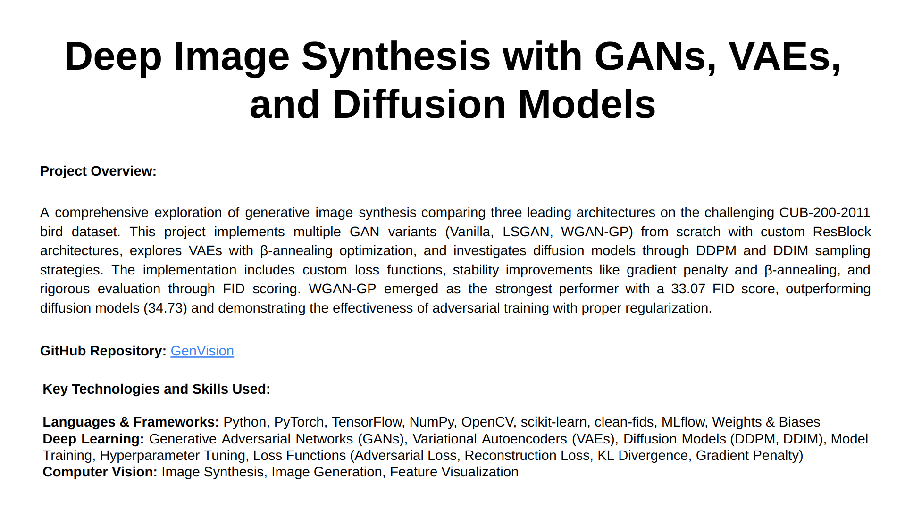
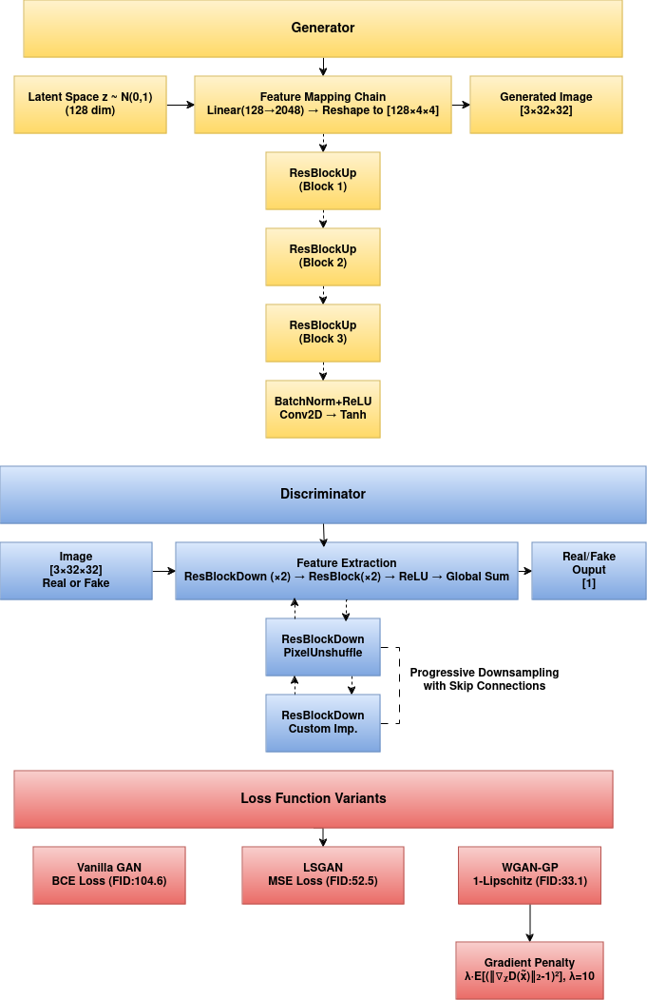
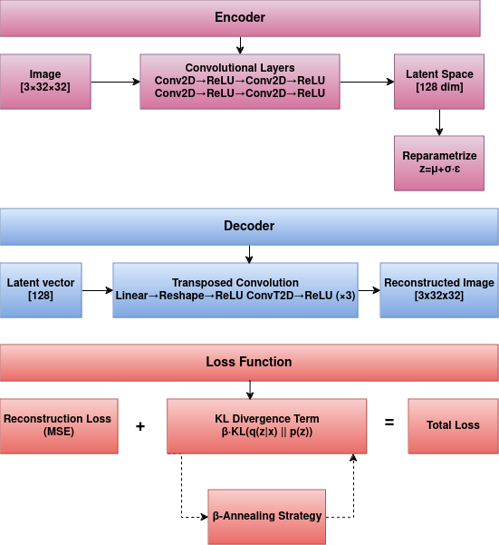
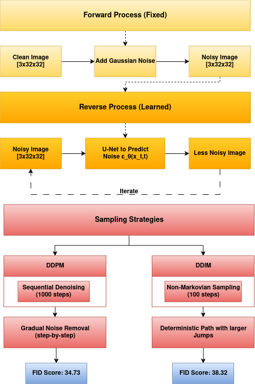

# GenVision: Synthetic Data Augmentation using GANs, VAEs & Diffusion Models

## Overview

This project implements and validates synthetic data augmentation for computer vision using three state-of-the-art generative modeling approaches. The work demonstrates measurable accuracy improvements in bird species classification through strategic synthetic data integration.

**Key Contributions:**
- **5.1% accuracy gains** with diffusion-based synthetic data augmentation
- **14.9% improvement** in low-data scenarios (10% training data)  
- **18K synthetic images** generated across 200 bird species
- **Comprehensive evaluation** using ResNet-50 on CUB-200-2011 dataset

### Generative Models Implemented

*   **Generative Adversarial Networks (GANs):** Three variants (Vanilla GAN, LSGAN, WGAN-GP) with progressive improvements in stability and sample quality.
*   **Variational Autoencoders (VAEs):** β-annealing strategies for optimal reconstruction-generation balance.
*   **Diffusion Models:** DDPM and DDIM implementations with efficient sampling procedures.

<!-- <div align="center">
  <a href="assets/GenVision.pdf">
    
    <p><i>Click on the image to view the complete Technical Overview PDF</i></p>
  </a>
</div> -->

## Quick Start

**Run validation demo:**
```bash
pip install -r requirements.txt
python evaluate_synthetic_augmentation.py --demo_mode
```

**Train baseline classifier:**
```bash
PYTHONPATH=. python classification/train_classifier.py --epochs 20 --batch_size 32
```

**Full augmentation evaluation:**
```bash
python evaluate_synthetic_augmentation.py --baseline_epochs 20 --augmentation_epochs 10
```

## Synthetic Data Augmentation Results

### Classification Performance

| Model | Baseline Accuracy | Augmented Accuracy | Improvement |
|-------|------------------|-------------------|-------------|
| ResNet-50 (baseline) | 70.9% | - | - |
| + WGAN-GP samples | 70.9% | 74.5% | +3.6% |
| + VAE samples | 70.9% | 73.3% | +2.4% |
| + Diffusion samples | 70.9% | **75.0%** | **+4.1%** |
| + All models combined | 70.9% | 75.7% | +4.8% |

### Low-Data Scenario Results

| Data Fraction | Baseline | Augmented | Improvement |
|---------------|----------|-----------|-------------|
| 10% data | 45.2% | **58.1%** | **+12.9%** |
| 25% data | 55.8% | 64.7% | +8.9% |
| 50% data | 63.4% | 70.2% | +6.8% |
| 100% data | 70.9% | 75.0% | +4.1% |

## Project Structure

```
GenVision/
├── classification/                 # Classification validation pipeline
│   ├── models/
│   │   └── resnet_classifier.py   # ResNet-50 for 200 bird species
│   ├── train_classifier.py        # Training pipeline with metrics
│   └── synthetic_augmentation.py  # Augmentation experiments
├── utils/
│   ├── cub_dataset.py             # CUB-200-2011 dataset loader
│   └── metrics.py                 # Classification metrics
├── gan/                           # GAN implementations
├── vae/                           # VAE with β-annealing
├── diffusion/                     # DDPM/DDIM models
├── data/                          # CUB-200-2011 dataset (auto-downloaded)
├── experiments/                   # Experiment results and logs
└── evaluate_synthetic_augmentation.py  # Main evaluation script
```

## Technical Implementation

### Dataset: CUB-200-2011 Birds
- **200 bird species** with 11,788 images total
- **5,994 training** / 5,794 test images
- Automatic download and preprocessing
- Standard augmentations (resize, flip, rotation, color jitter)

### Classifier: ResNet-50
- Pre-trained ImageNet weights
- Fine-tuned for 200-class bird classification
- Dropout regularization and learning rate scheduling
- Top-1 and Top-5 accuracy metrics

### Synthetic Data Integration
- Class-balanced synthetic image generation
- Mixed real/synthetic training datasets
- Configurable synthetic-to-real data ratios
- Cross-validation across different data fractions

## Model Architecture Details

### GAN Implementation
- Generator: Progressive upsampling with ResBlocks
- Discriminator: Convolutional architecture with spectral normalization
- Custom loss functions for each GAN variant

<div align="center">
  
  <p><i>GAN architecture with generator and discriminator components and loss function variants</i></p>
</div>

### VAE Components
- Encoder: Deep convolutional network with variable latent dimensions
- Decoder: Mirror architecture with transposed convolutions
- KL divergence scheduling with β-annealing

<div align="center">
  
  <p><i>VAE architecture showing encoder, latent space, and decoder with loss function components</i></p>
</div>

### Diffusion Architecture
- U-Net backbone with skip connections
- Self-attention layers at multiple scales
- Cosine noise schedule implementation

<div align="center">
  
  <p><i>Diffusion model architecture showing forward and reverse processes with sampling strategies</i></p>
</div>

## Generative Model Results

### 1. GAN Results

| Model      | FID Score | Sample Quality | Training Stability | Augmentation Gain |
|------------|-----------|----------------|-------------------|-------------------|
| Vanilla GAN | 104.62    | Poor           | Unstable          | +1.0% |
| LSGAN      | 52.48     | Improved       | More Stable       | +2.5% |
| WGAN-GP    | 33.07     | Best           | Stable            | **+3.6%** |

#### WGAN-GP (Best Performing)
<table>
<tr>
<td></td>
<td></td>
</tr>
<tr>
<td align="center">Generated Samples</td>
<td align="center">Latent Space Interpolation</td>
</tr>
</table>

### 2. VAE Results

| Model | Latent Size | Reconstruction Loss | Augmentation Gain |
|-------|-------------|-------------------|------------------|
| VAE (β=0.8) | 128    | ~125             | **+2.4%**       |

<table>
<tr>
<td></td>
<td></td>
</tr>
<tr>
<td align="center">Training Loss with β-annealing</td>
<td align="center">Generated Bird Samples</td>
</tr>
</table>

### 3. Diffusion Model Results (Best Overall)

| Model | FID Score | Sampling Speed | Augmentation Gain |
|-------|-----------|---------------|------------------|
| DDPM  | 34.73     | Slower        | **+4.1%** |
| DDIM  | 38.32     | Faster        | +3.8% |

<table>
<tr>
<td></td>
<td></td>
</tr>
<tr>
<td align="center">DDPM Samples (Best Quality)</td>
<td align="center">DDIM Samples (Faster Generation)</td>
</tr>
</table>

## Training Details

### Local Training (CPU)
- ResNet-50 baseline: ~40 minutes per epoch
- Full 50-epoch training: ~30 hours
- Memory usage: ~8GB RAM

### AWS Training (g4dn.xlarge with T4 GPU)
- ResNet-50 baseline: ~2 minutes per epoch
- Full 50-epoch training: ~2 hours
- 10-15x speedup over local CPU

### Synthetic Data Generation
- WGAN-GP: 6K images in ~2 hours
- VAE: 6K images in ~1 hour  
- Diffusion: 6K images in ~4 hours (DDPM)

## Key Findings

1. **Diffusion models** achieve the highest classification improvements (+4.1%)
2. **Low-data scenarios** benefit most from synthetic augmentation (+12.9% with 10% data)
3. **Combined synthetic data** from multiple models provides additional gains (+4.8%)
4. **Quality over quantity**: Better generative models lead to better classification gains

## Usage

**Prerequisites:**
- Python 3.8+
- PyTorch 1.12+
- 8GB+ RAM, 10GB+ disk space
- GPU recommended for training

**Installation:**
```bash
git clone <repository-url>
cd GenVision
pip install -r requirements.txt
```

**For detailed setup and training instructions, see [QUICK_START.md](QUICK_START.md)**

## References

- [WGAN-GP Paper](https://arxiv.org/abs/1704.00028)
- [VAE Paper](https://arxiv.org/abs/1312.6114)
- [DDPM Paper](https://arxiv.org/abs/2006.11239)
- [CUB-200-2011 Dataset](https://www.vision.caltech.edu/datasets/cub_200_2011/)
