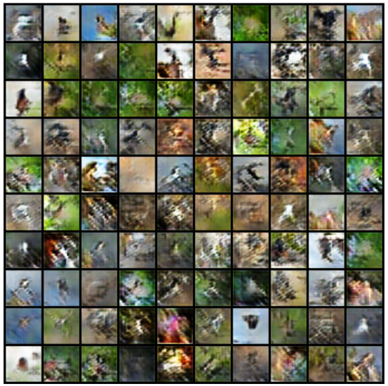

# GenVision: Advanced Generative Models for Image Synthesis

A comprehensive implementation of three state-of-the-art generative architectures: GANs (Generative Adversarial Networks), VAEs (Variational Autoencoders), and Diffusion Models. Each architecture is implemented with multiple variants and tested on standard benchmarks.

## Overview

This project explores three fundamentally different approaches to deep generative modeling:

*   **Generative Adversarial Networks (GANs):** Implementation of three variants (Vanilla GAN, LSGAN, WGAN-GP) with progressive improvements in stability and sample quality.
*   **Variational Autoencoders (VAEs):** Exploration of different latent space dimensions and β-annealing strategies for optimal reconstruction-generation balance.
*   **Diffusion Models:** Implementation of efficient sampling procedures (DDPM and DDIM) with pre-trained models.

### 1. GAN Results

| Model      | FID Score | Sample Quality | Training Stability |
|------------|-----------|----------------|-------------------|
| Vanilla GAN | 104.62    | Poor           | Unstable          |
| LSGAN      | 52.48     | Improved       | More Stable       |
| WGAN-GP    | 33.07     | Best           | Stable            |

#### Vanilla GAN
<table>
<tr>
<td></td>
<td></td>
</tr>
<tr>
<td align="center">Samples</td>
<td align="center">Latent Space Interpolation</td>
</tr>
</table>

#### LSGAN
<table>
<tr>
<td></td>
<td></td>
</tr>
<tr>
<td align="center">Samples</td>
<td align="center">Latent Space Interpolation</td>
</tr>
</table>

#### WGAN-GP
<table>
<tr>
<td></td>
<td></td>
</tr>
<tr>
<td align="center">Samples</td>
<td align="center">Latent Space Interpolation</td>
</tr>
</table>

### 2. VAE Results

#### Performance Analysis

| Model | Latent Size | Reconstruction Loss | Sample Quality |
|-------|-------------|-------------------|----------------|
| AE    | 16          | ~200              | Poor           |
| AE    | 128         | ~75               | Good           |
| AE    | 1024        | ~40               | Best           |
| VAE (β=0.8) | 128    | ~125             | Improved       |

#### Autoencoder Loss Curves
<table>
<tr>
<td></td>
<td></td>
<td></td>
</tr>
<tr>
<td align="center">Latent Size: 16</td>
<td align="center">Latent Size: 128</td>
<td align="center">Latent Size: 1024</td>
</tr>
</table>

#### Autoencoder Reconstructions
<table>
<tr>
<td></td>
<td></td>
<td></td>
</tr>
<tr>
<td align="center">Latent Size: 16</td>
<td align="center">Latent Size: 128</td>
<td align="center">Latent Size: 1024</td>
</tr>
</table>

#### VAE with β-annealing Results
- Best β value: 0.8 (selected based on sample quality and reconstruction fidelity)
<table>
<tr>
<td></td>
<td></td>
<td></td>
</tr>
<tr>
<td align="center">Reconstruction Loss</td>
<td align="center">KL Loss</td>
<td align="center">Generated Samples</td>
</tr>
</table>

**Key Findings:**
- Larger latent sizes (1024) produce significantly better reconstructions
- β-annealing improves sample quality while maintaining good reconstruction
- Trade-off between reconstruction quality and sampling capability is evident across different configurations

### 3. Diffusion Model Results

| Model | FID Score | Sampling Speed |
|-------|-----------|---------------|
| DDPM  | 34.73     | Slower        |
| DDIM  | 38.32     | Faster        |

<table>
<tr>
<td></td>
<td></td>
</tr>
<tr>
<td align="center">DDPM Samples</td>
<td align="center">DDIM Samples</td>
</tr>
</table>

## Model Architecture Details

### GAN Implementation
- Generator: Progressive upsampling with ResBlocks
- Discriminator: Convolutional architecture with spectral normalization
- Custom loss functions for each GAN variant

### VAE Components
- Encoder: Deep convolutional network with variable latent dimensions
- Decoder: Mirror architecture with transposed convolutions
- KL divergence scheduling with β-annealing

### Diffusion Architecture
- U-Net backbone with skip connections
- Self-attention layers at multiple scales
- Cosine noise schedule implementation

## Key Technical Achievements

1. **GAN Improvements:**
   - Successfully stabilized training with gradient penalty
   - Achieved consistent FID improvement across variants
   - Implemented smooth latent space interpolation

2. **VAE Optimization:**
   - Identified optimal latent space dimensions
   - Implemented effective β-annealing strategy
   - Balanced reconstruction and generation quality

3. **Diffusion Advances:**
   - Efficient DDIM sampling implementation
   - Maintained quality with reduced sampling steps
   - Robust noise schedule management

## Installation and Usage

```bash
# Clone repository
git clone https://github.com/username/GenVision.git
cd GenVision

# Install dependencies
pip install -r requirements.txt

# Training
python train.py --model [gan/vae/diffusion] --config configs/default.yaml
```

## References

- [WGAN-GP Paper](https://arxiv.org/abs/1704.00028)
- [VAE Paper](https://arxiv.org/abs/1312.6114)
- [DDPM Paper](https://arxiv.org/abs/2006.11239)
